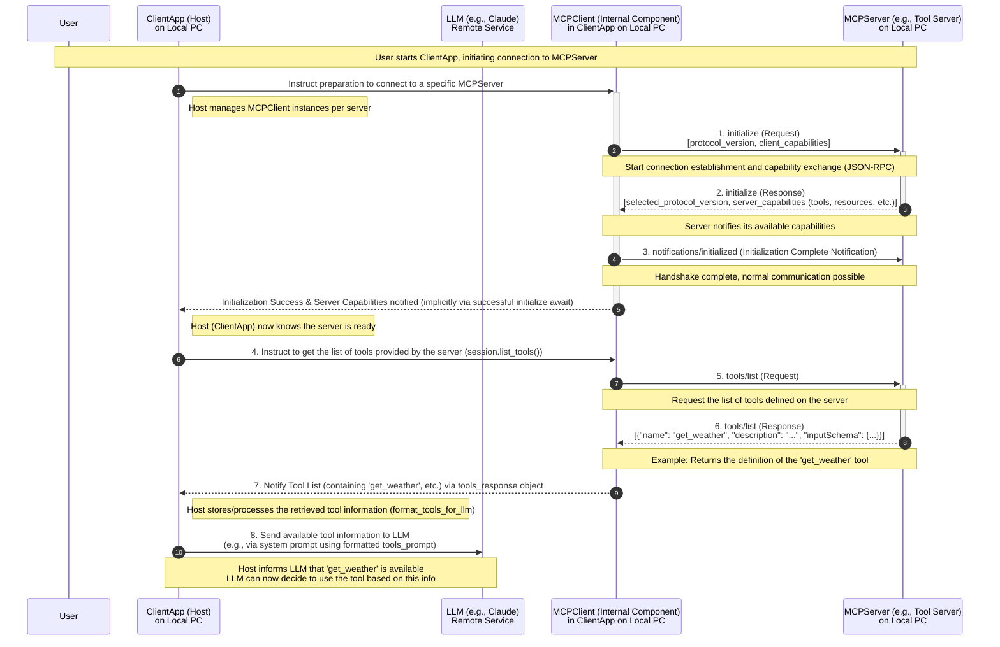
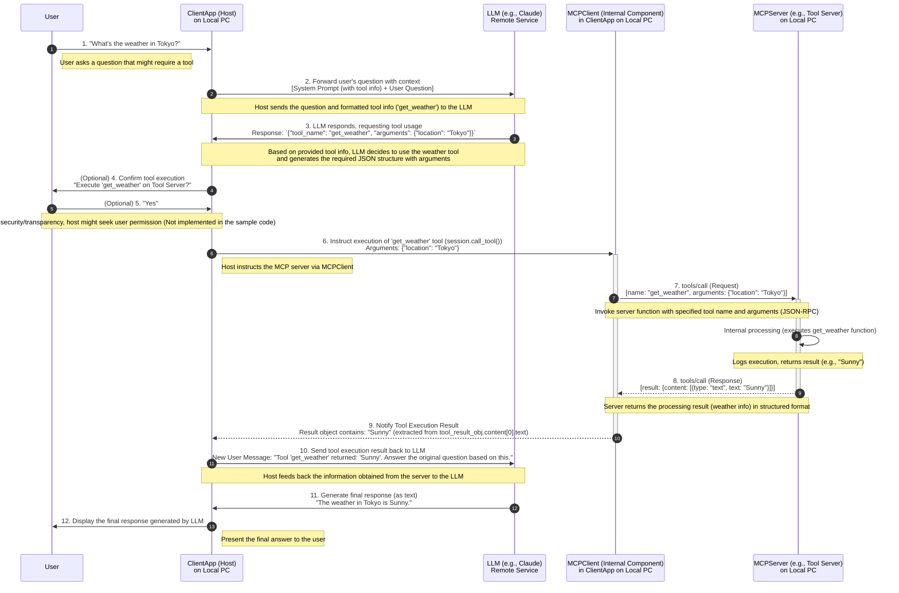

# MCP(Model Context Protocol) minimal Kotlin client server sample

A simple weather tool demonstrating server-client interaction using the Model Context Protocol (MCP). For demonstration purposes only.

User: "What's the weather in Tokyo?"  
Response: "The weather in Tokyo is sunny."

This is a Kotlin version of [mcp-minimal-client-weather-server-sample](https://github.com/takahirom/mcp-minimal-client-weather-server-sample)

client: src/main/kotlin/Client.kt
server: server.main.kts

**Diagram 1: Initialization and Tool Discovery**

**Diagram 2: Tool Execution Flow**

